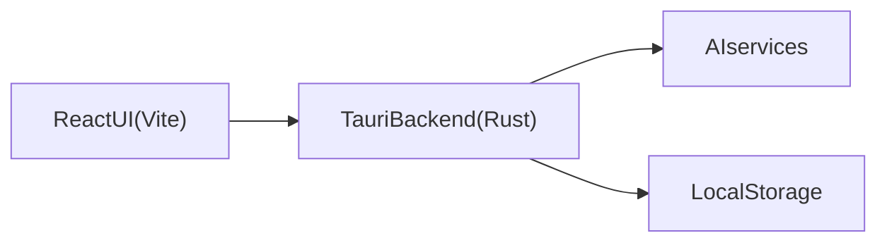

# Lexi Cut


Lexi Cut is a desktop, text-based video editor. It transcribes footage, lets you edit by manipulating text, and keeps the timeline in sync with the underlying media. It also uses AI services to help with narrative ordering and visual descriptions.

## What it does

- Import video/audio sources and transcribe them into words and sentences
- Edit by rearranging or excluding sentences and words
- Generate an initial assembly cut from AI analysis
- Attach visual descriptions to segments for faster browsing
- Export the resulting timeline

## System architecture

Lexi Cut is a Tauri desktop app with a React UI, a Rust backend, and an AI service layer. Data is persisted to local storage so projects can be re-opened and edited later.



### Core pieces

- **UI**: React + Vite, with Remotion for playback and timeline rendering.
- **Backend**: Tauri commands for filesystem access, hashing, caching, and exports.
- **AI services**: ElevenLabs (transcription), Anthropic (assembly cut), Gemini (visual descriptions), Late (upload). See `docs/AI_SERVICES.md`.
- **Persistence**: Projects are stored under `~/Documents/Lexi Cut/` as JSON plus media metadata. See `docs/project_save.md`.

## Processing pipeline

The end-to-end processing flow lives in `src/api/processingPipeline.ts` and runs when sources are added:

1. **CID pre-phase**
   - Compute a content hash (CID) per source in parallel.
   - Wait for any existing background work tied to the same CID.
2. **Transcription (per source)**
   - Read the file via Tauri (`read_file_base64`) and convert to a browser `File`.
   - Call ElevenLabs transcription (cache-aware via CID).
   - Map the transcript into word-level `Word[]`.
   - Track sources with zero words as transcriptless (video-only).
3. **Grouping**
   - Group words by source into `SegmentGroup[]` using sentence boundaries and duration limits.
   - Create a video-only group for transcriptless sources (0s -> duration).
4. **Optional visual descriptions**
   - If `VITE_GEMINI_API_KEY` is set, extract frames and ask Gemini for time-ranged descriptions.
   - Attach descriptions to the source; failures are non-fatal and skipped.
5. **Sentence and timeline prep**
   - Split words into sentence groups for timeline entries.
   - Create sentences for transcriptless sources and mark them as B-roll (`no-speech`).
6. **Ordering**
   - Produce a chronological baseline order for groups.
   - Agentic assembly cut runs later in the UI to refine ordering.

### What is a CID?

A CID (content ID) is a deterministic hash of a source file’s bytes. It changes when the file changes, and stays stable when the file is identical. Lexi Cut generates CIDs locally through the Tauri backend and uses them to:

- Cache AI results like transcriptions and visual descriptions
- De-duplicate work across sessions and projects when the source file is unchanged
- Coordinate background processing and avoid duplicate in-flight work

### Pipeline optimizations

- **Cache-first behavior**: transcription and description requests are keyed by CID, so repeated imports reuse cached results.
- **Parallel CID computation**: missing CIDs are computed concurrently before the pipeline starts.
- **In-flight coordination**: the pipeline waits for any background processing already running for the same CID before starting.
- **Parallel visual descriptions**: Gemini descriptions run concurrently per source and are skipped entirely when the API key is missing.

### Frame extraction details

Frame extraction is handled by a Tauri command (`extract_frames_base64`) and uses a hybrid strategy:

- **Keyframes first**: uses `ffprobe` to collect I-frame timestamps (natural scene boundaries).
- **Gap filling**: if gaps are larger than 5 seconds, fill at ~1 fps.
- **Deduping**: avoid frames closer than 1 second apart.
- **Subsampling**: cap to 60 frames by evenly distributing timestamps.
- **Extraction**: uses `ffmpeg` to export JPEGs at selected timestamps, returned as base64 strings with timestamps.

This keeps the Gemini payload small while still sampling visually meaningful frames.

## Data types

Core data types are defined in `src/types/index.ts`:

- `Source`: media file metadata, optional `cid`, and optional `descriptions`.
- `Word`: word-level transcript timing and confidence.
- `Sentence`: grouped words used as the primary editable unit.
- `SegmentGroup`: grouped words for assembly cut analysis.
- `Timeline` / `TimelineEntry`: serialized edit state.
- `SourceDescription`: time-ranged visual descriptions for a source.
- `ProcessingProgress`: progress updates for the pipeline.
- `BrollClassification`: flags for transcriptless or non-narrative content.

## Cache

Lexi Cut caches expensive AI results using a local SQLite database (`cache.db`) in the Tauri app data directory.

- **Key**: `CID + data_type` (CID is a hash of the source file contents)
- **Data types**: `transcription` and `descriptions`
- **Purpose**: Avoid re-transcribing or re-describing the same media if the file is unchanged
- **Implementation**: `src/api/cache.ts` wraps Tauri commands (`get_cached`, `set_cached`) backed by `src-tauri/src/services/cache_db.rs`

## Dependencies

### Tooling

- Node.js (LTS) and a package manager (`pnpm` recommended, `npm` supported)
- Rust toolchain (stable) and the Tauri CLI

### Runtime libraries (high level)

- React + Vite UI
- Remotion for video composition and playback
- Zustand for app state
- Tauri plugins for HTTP, dialog, and opener

## Environment setup

Copy `.env.example` to `.env` and fill in keys:

- `VITE_ELEVENLABS_API_KEY`
- `VITE_ANTHROPIC_API_KEY`
- `VITE_GEMINI_API_KEY`
- `VITE_LATE_API_KEY`

See `docs/AI_SERVICES.md` for API details and how each service is used.

## Run locally

Install dependencies:

```
pnpm install
```

Start the desktop app (Tauri):

```
pnpm tauri dev
```

Build the desktop app:

```
pnpm tauri build
```

You can also run the UI in a browser (limited, no native file access):

```
pnpm dev
```

## Notes

- Network calls use the Tauri HTTP plugin to avoid CORS issues in the webview.
- Project data and exports are stored locally; see `docs/project_save.md` for structure.

## Attribution

Created by [Kelindi](https://github.com/kelindi) and [ArEnSc](https://github.com/ArEnSc).
